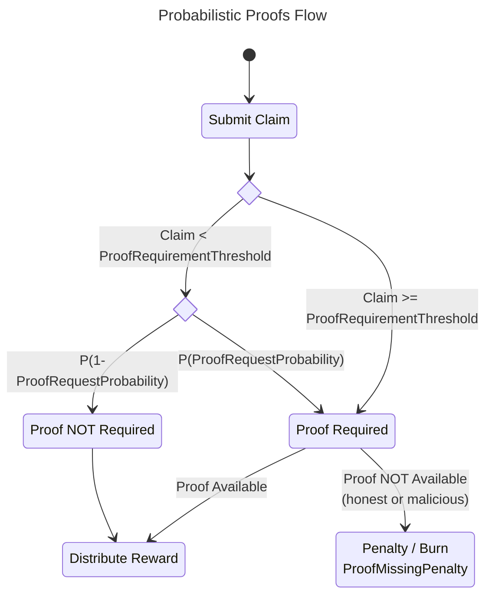

# Probabilistic Proofs <!-- omit in toc -->

<p align="center">
    @olshansk - Daniel Olshansky<br>
    @RawthiL - Ramiro Rodríguez Colmeiro<br>
    Feb 2023
</p>

This is a specification & proposal that will be submitted to [forum.pokt.network](https://forum.pokt.network) after peer-review.

**tl;dr Values Selected**

- `Pr(X<=k)` = `0.99`; selected manually to maintain 2 nine protocol safety
- `k` (num failures) = `16`; computed using a cumulative geometric probability distribution
- `ProofRequestProbability` = `0.25`; selected manually to scale the network by 4x
- `ProofRequirementThreshold` = `20 POKT`; selected to a value that is above p95 of all POKT claims
- `ProofMissingPenalty` = `320 POKT`; calculated via `ProofRequirementThreshold * k` to deter malicious behaviour

**The question being answered by the distribution**: What is the probability of the protocol trusting (i.e. failing) `k` Claims or less (i.e. handling a normal claim or not catching an attacker) until a single penalty enforcement (i.e. successfully catching an attacker).

**Answer**: Selecting `k = 16` and `ProofRequirementThreshold = 20 POKT` implies that if an attacker continues submitting claims for `19.99 POKT` or less, they will get caught `99%` of the time, and will be penalized for `320 POKT`.

## Table of Contents <!-- omit in toc -->

- [Summary](#summary)
- [Specification](#specification)
  - [Governance Parameters](#governance-parameters)
  - [Parameter Usage](#parameter-usage)
  - [Flow](#flow)
  - [Scaling Benefits](#scaling-benefits)
    - [Block Data Verification](#block-data-verification)
- [Attack Modelling](#attack-modelling)
  - [Approach](#approach)
  - [Definitions](#definitions)
  - [Example](#example)
  - [Model](#model)
  - [Geometric PDF](#geometric-pdf)
  - [Geometric CDF](#geometric-cdf)
  - [Selecting Values](#selecting-values)
    - [Calculation](#calculation)
- [Dissenting Opinions](#dissenting-opinions)
  - [Malicious Attackers Bloating State](#malicious-attackers-bloating-state)
  - [Honest Servicers Getting Burnt](#honest-servicers-getting-burnt)
- [Appendix](#appendix)
  - [Claim Data](#claim-data)
  - [Python Code](#python-code)
    - [Python Code - Geometric PDF](#python-code---geometric-pdf)
    - [Python Code - Geometric CDF](#python-code---geometric-cdf)

## Summary

The number of relays in Pocket Network (V0) is limited by the amount of block space utilized by Claim Proofs. The estimations done [here](https://docs.google.com/document/d/1QcsPfhj636zBazw2jAay8H6gdBKXcIMmohY0o321hhQ/edit) approximated it to be ~3B/day.

Several solutions were proposed [in this document](https://docs.google.com/document/d/1uBomaVieGAjsyHeqSlwmqOyPOln1CemVlWXZjQXUMRY/edit). This proposal outlines an alternate solution: **Probabilistic Proofs**.

In order for Servicers to be rewarded for their work, a fraction of the Claims submitted on-chain will require a Proof to also be submitted-on chain probabilistically under the random Oracle model.

This document assumes the reader has an understanding of the [reward protocol](https://github.com/pokt-network/pocket-core/blob/staging/doc/specs/reward_protocol.md).

## Specification

### Governance Parameters

Three new governance parameters will need to be added:

- `ProofRequestProbability`: Probability that a Claim will require a Proof to be rewarded; x ∈ ℝ ∣ 0 < x ≤ 1
- `ProofRequirementThreshold`: Claim amount (in uPOKT) above which a Proof will always be required; x ∈ ℝ ∣ x > 0
- `ProofMissingPenalty`: Burn (in uPOKT) that the Servicer faces if it does not provide a proof within `pocketcore/ClaimExpiration` for a Claim it previously submitted; x ∈ ℝ ∣ x > 0

### Parameter Usage

$$
Probably(ProofRequired) =
  \begin{cases}
    ProbabilityOfProofRequest &\text{if } Claim < ProofRequiredThreshold  \\
    1 &\text{if } Claim >= ProofRequiredThreshold.
  \end{cases}
$$

### Flow

The high-level flow is captured in the following diagram:



### Scaling Benefits

Assuming the majority of the block space is taken up by Proofs, The number of relays in the network scales inversely to `ProofRequestProbability`. Example:

- `ProofRequestProbability` = 0.5 -> 2x scale (~6B relays)
- `ProofRequestProbability` = 0.25 -> 4x scale (~12B relays)
- `ProofRequestProbability` = 0.1 -> 10x scale (~30B relays)

**Side benefit**: It has been shown that the majority of block verification time is spent validating the Proofs, so there would also be an upside on resource consumption. Showing backing data for this is outside the scope of this document.

#### Block Data Verification

The [notebook here](./Pocket_Network_Statistical_Proofs.ipynb) originally authored by @RawthiL in [this gist](https://gist.github.com/RawthiL/05fbfaf76ddc199eda4a303559bff0b3) captures the that the Block Size composition is approximately:

- Proofs : 67.06 %
- Claims : 21.64 %

This goes to show that reducing the number of Proofs & Claims submitted on-chain would increase the capacity of the network.


## Attack Modelling

In order to select the values for the three parameters, the attacker's likelihood of adversarial reward & penalty must be modeled.

### Approach

An _attack by example_ approach is used determining the appropriate values for `ProofRequestProbability`, `ProofRequirementThreshold` and `ProofMissingPenalty`. This will demonstrate the optimal malicious behaviour an attacker should follow and tend to that case.

### Definitions

A Bernoulli probability distribution will be used whereby each `Claim` & `Proof` pair can be treated as an independent Bernoulli Trial. When the `Claim` exceeds `ProofRequirementThreshold`, the model is _"short-circuited"_ and is therefore outside the sample space for this definition.

The definition for success is taken from the Network's point of view.

- **Success**: Servicer submits a false claim and gets caught
- **Failure** (the remainder of the sample space excluding Success):
  - Servicer submits a true claim and is required prove it
  - Servicer a true claim and have no requirement to prove it
  - Servicer submits a false claim and gets away with it
  - Servicer submits a true claim, but fails to prove it

### Example

Let `ProofRequirementThreshold = 100 POKT`

If the `Claim` is greater than or equal to `100 POKT`, a proof is mandatory and the model is _"short-circuited"_. Therefore, the attacker can _freeload_ by submitting claims for `99.99 POKT` and hope they never get caught. If they do get caught (i.e. `Success`), the burn (i.e. `ProofMissingPenalty`) should exceed the total reward accumulated.

Since each claim is independent, an attacker would never submit a `Claim` exceeding `ProofRequirementThreshold`, and therefore have a `ProofRequestProbability` likelihood of being required to submit a proof.

### Model

A [Geometric PDF](https://en.wikipedia.org/wiki/Geometric_distribution) was selected to identify the probability of `k` failures (sample space containing an attacker getting away) until a single success (an attacker is caught).

However, as pointed out by @RawthiL, what we're actually interested in is the likelihood of `k` **or less** failures until a single success.

### Geometric PDF

$$ p = ProofRequestProbability $$

$$ q = 1 - p $$

$$ Pr(X=k) = (1-p)^{k-1}p $$

$$ k = \frac{ln(\frac{Pr(X=k)}{p})}{ln(1-p)} + 1 $$


### Geometric CDF

$$ x ∈ ℝ ∣ 0 ≤ x < 1 $$

$$ p = ProofRequestProbability $$

$$ P(X<=k) = 1 - (1 - p)^{k} $$

$$ k = \frac{log(1 - P(X<=k))}{log(1 - p)} $$


### Selecting Values

#### Calculation

`ProofRequirementThreshold` should be as small as possible so that most such that most Claims for into the probabilistic bucket, while also balancing out penalties that may be too large for faulty honest Servicers. Ideally, it should be selected to be `2σ` above the Claim `μ` such that `97.3%` fall into the `ProofRequestProbability` part of the piecewise function. However, as seen in the Appendix, the POKT Claim distribution does not follow a normal distribution. Instead, 20 POKT was selected since it is greater than `p95` of POKT claim using the data collected.

`ProofRequestProbability (p)` is selected as `0.25` to enable scaling the network by `4x`.

`BurnForFailedClaimSubmission` - Should be set to `k * ProofRequirementThreshold` to deter `k` failures or less.

`Pr(X<=k)` must be as high as possible while keeping `k` reasonably low since it'll impact the penalty for honest but faulty servicers that fail to submit a Claim within the expiration window. We are selecting `Pr(X<=k) = 0.99`

$$ k = \frac{log(1 - P(X<=k))}{log(1 - p)} $$

$$ k = \frac{log(1 - 0.99)}{log(1 - 0.25)} $$

$$ k ≈ 16 $$

Selecting `k = 16` implies that `99%` of the time, an attacker will get a penalty of `BurnForFailedClaimSubmission`, making it not worthwhile to take the risk.

## Dissenting Opinions

### Malicious Attackers Bloating State

**Q**: Adversarial actors may continue submitting Proofs in excess of what's required to bloat the state of the chain.

**A**: In the Random Oracle model, only pseudo-randomly selected Claims seeded by on-chain data (e.g. LastBlockHash, hash(claim), ServicerPubKey, etc...) will be included by block proposers.

### Honest Servicers Getting Burnt

**Q**: An honest Servicer that submitted a Claim, but failed to submit a Proof within `pocketcore/ClaimExpiration` will be burnt. In today's model, they will only lose the rewards for the unproven Claim.

**A**: The onus is on the Servicer to upkeep their infrastructure. This is a tradeoff that must be considered as a risk/reward in exchange for the network's growth.

## Appendix

### Claim Data

The claim data below was collected by @RawthiL [here](https://github.com/pokt-network/pocket-core/issues/1523#issuecomment-1441924408).

| Percentage | Limit     |
| ---------- | --------- |
| 25.0       | 1.010101  |
| 50.0       | 2.525253  |
| 75.0       | 5.555556  |
| 90.0       | 16.161616 |
| 95.0       | 18.181818 |


### Python Code

#### Python Code - Geometric PDF

```python
import numpy as np
import matplotlib.pyplot as plt
from matplotlib import cm

def pdf(x, p):
    return np.log(x/p) / np.log(1-p)

# Line Graph
x = np.linspace(0.01, 1, 200)

# Points
xp = np.linspace(0.01, 1, 20)

# Plot the actual functions
ps = [0.25, 0.5, 0.75, 0.9]
colors = cm.get_cmap('hsv', len(ps)+1)
for i, p in enumerate(ps):
    color = colors(i)
    y = pdf(x, p)
    yp = pdf(xp, p)
    plt.plot(x, y, label=f'p = {p}', color=color)
    # Select only the points where y > 0 and plot them as dots
    x_pos = xp[np.where(yp > 0)]
    y_pos = yp[np.where(yp > 0)]
    plt.plot(x_pos, y_pos, 'o', color=color)


# Add a horizontal line at y = 0
plt.axhline(y=0, color='gray', linestyle='--')

# Add legend, axis labels, and title
plt.legend()
plt.xlabel('Probability(X=k)')
plt.ylabel('k (num failures)')
plt.title('Number of failures until a single success')

# Display the plot
plt.show()
```

#### Python Code - Geometric CDF

```python
import numpy as np
import matplotlib.pyplot as plt
from matplotlib import cm

def cdf(x, p):
    return np.log(1-x)/np.log(1-p)

# Line Graph
x = np.linspace(0.01, 1, 200)

# Points
xp = np.linspace(0.01, 1, 20)

# Plot the actual functions
ps = [0.25, 0.5, 0.75, 0.9]
colors = cm.get_cmap('hsv', len(ps)+1)
for i, p in enumerate(ps):
    color = colors(i)
    y = cdf(x, p)
    yp = cdf(xp, p)
    plt.plot(x, y, label=f'p = {p}', color=color)
    # Select only the points where y > 0 and plot them as dots
    x_pos = xp[np.where(yp > 0)]
    y_pos = yp[np.where(yp > 0)]
    plt.plot(x_pos, y_pos, 'o', color=color)


# Add a horizontal line at y = 0
plt.axhline(y=0, color='gray', linestyle='--')

# Add legend, axis labels, and title
plt.legend()
plt.xlabel('Probability(X<=k)')
plt.ylabel('k (num failures)')
plt.title('CDF - k failures or less until a single success')

# Display the plot
plt.show()
```
