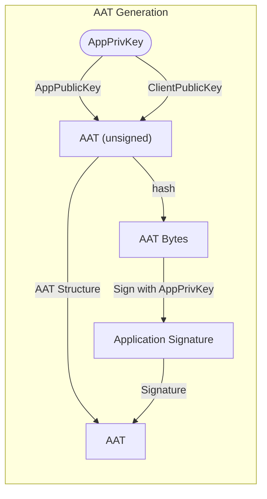
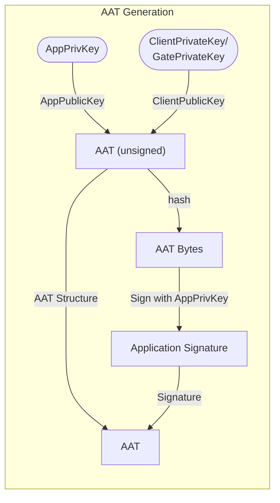
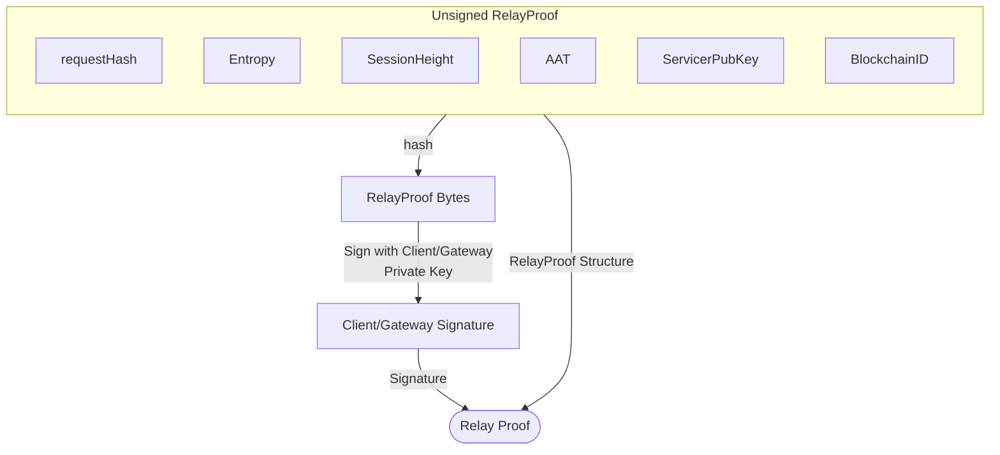

# Application Authentication Token <!-- omit in toc -->

- [Data Structure Schema](#data-structure-schema)
  - [version](#version)
  - [signature](#signature)
  - [applicationPublicKey](#applicationpublickey)
  - [clientPublicKey](#clientpublickey)
- [ECDSA ed25519 Signature Scheme](#ecdsa-ed25519-signature-scheme)
- [AAT Generation](#aat-generation)
  - [1. Application === Client (Gateway)](#1-application--client-gateway)
  - [2. Application !== Gateway (Client)](#2-application--gateway-client)
  - [AAT Signature Generation](#aat-signature-generation)
  - [Relay Generation \& Signing using AAT](#relay-generation--signing-using-aat)

## Data Structure Schema

An AAT must contain the following fields:

### version

> type: `string`

A semver string specifying the spec version under which this AAT needs to be interpreted.

### signature

> type: `string`

The `Application` will sign a hash of a marshalled AAT structure where all the fields
are populated with the exception of the `Signature` itself. The resultant `Signature`
is the one that's populated in the `AAT`.

### applicationPublicKey

> type: `string`

The hexadecimal `publicKey` of the `Application`

### clientPublicKey

> type: `string`

Required for signature verification.

Also known as the `gatewayPublicKey`.

The hexadecimal public key allowing granular control of who can use the `AAT`.

## ECDSA ed25519 Signature Scheme

The protocol wide ed25519 ECDSA will be used for any signatures and verifications
that are used within this specification.

## AAT Generation

When generating a new AAT, the owner of the `Application` private key has two options:

1. Use the same public key for signing the AAT and the relay requests
2. Use a different public key for signing the AAT and the relay requests

### 1. Application === Client (Gateway)



### 2. Application !== Gateway (Client)



### AAT Signature Generation

The proper way to sign the token is as follows:

1. JSON Encode AAT with an empty string signature field:
2. SHA3 \(256\) Hash the json bytes
3. Sign with ed25519 ECDSA
4. HexEncode the result bytes into a string

```bash
  AAT = {
    ApplicationSignature: "",
    ApplicationPublicKey: a.ApplicationPublicKey,
    ClientPublicKey:      a.ClientPublicKey,
    Version:              a.Version,
  }
  AATBytes = JSON.Encode(AAT)
  Message = SHA3_256(AATBytes)
  AAT.ApplicationSignature = ED25519.Sign(Message)
```

### Relay Generation & Signing using AAT

The `Client` is needed to sign the actual relays while the `Application` gets
charged on-chain. However, the `Application` only gets charged if the `Client`
signed the relay. The `Client` public key is in the `AAT` and had to be signed
by the `Application` during `AAT` generation.


