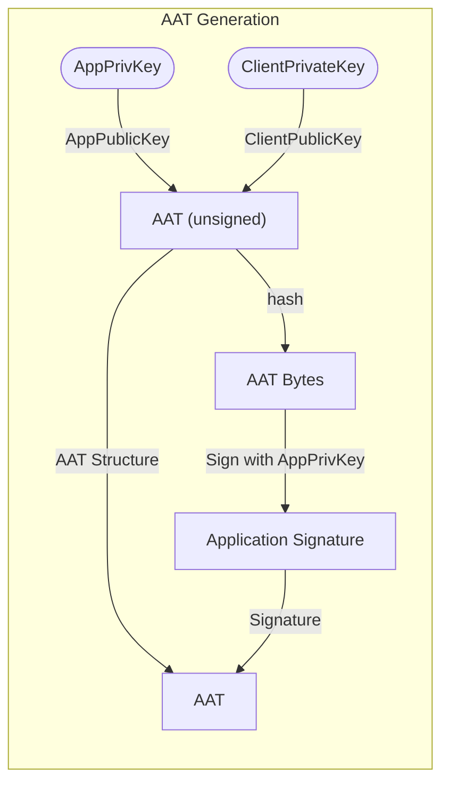
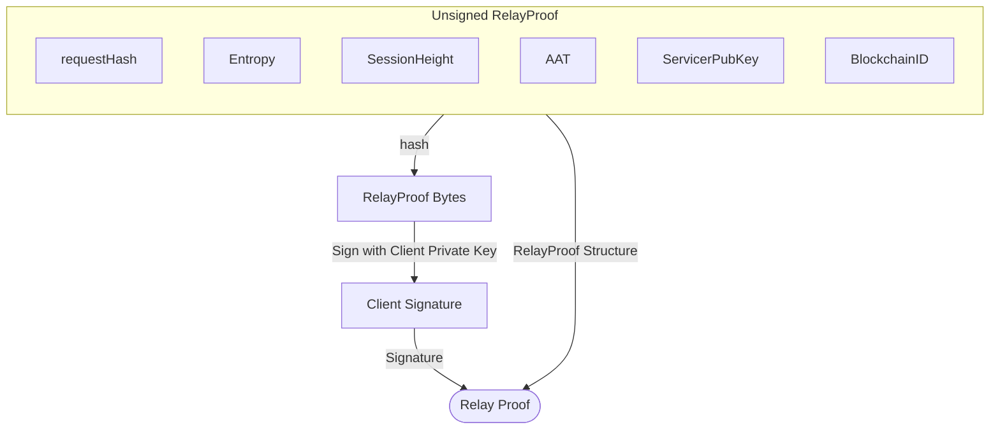

# Application Authentication Token <!-- omit in toc -->

The AAT serves to provide functionality for two separate entities:

1. An `Application` Owner to stake an `Application` on the blockchain
2. A `Client` Owner to submit relays through any type of dApp (from a command-line tool to Portal-like website)

It is important to note that one entity does not need to share their private key
with the other entity. `Application` owners can delegate the right to use their
staked `Application` to a `Client` by passing an AAT which includes their the
`Client` public key signed by the `Application` private key.

- [Data Structure Schema](#data-structure-schema)
  - [version](#version)
  - [signature](#signature)
  - [applicationPublicKey](#applicationpublickey)
  - [clientPublicKey](#clientpublickey)
- [ECDSA ed25519 Signature Scheme](#ecdsa-ed25519-signature-scheme)
- [AAT Generation](#aat-generation)
  - [AAT Signature Generation](#aat-signature-generation)
  - [Relay Generation \& Signing using AAT](#relay-generation--signing-using-aat)

## Data Structure Schema

An AAT must contain the following fields:

### version

> type: `string`

A semver string specifying the spec version under which this AAT needs to be interpreted.

### signature

> type: `string`

The `Application` will sign a hash of a marshalled AAT structure where all the fields
are populated with the exception of the `Signature` itself. The resultant `Signature`
is the one that's populated in the `AAT`.

### applicationPublicKey

> type: `string`

The hexadecimal `publicKey` of the `Application`

### clientPublicKey

> type: `string`

Required for signature verification.

The hexadecimal public key allowing granular control of who can use the `AAT`.

## ECDSA ed25519 Signature Scheme

The protocol wide ed25519 ECDSA will be used for any signatures and verifications
that are used within this specification.

## AAT Generation

When generating a new AAT, the owner of the `Application` private key can choose
which `Client` public key is used to sign Relays.



### AAT Signature Generation

The proper way to sign the token is as follows:

1. JSON Encode AAT with an empty string signature field:
2. SHA3 \(256\) Hash the json bytes
3. Sign with ed25519 ECDSA
4. HexEncode the result bytes into a string

```bash
  AAT = {
    ApplicationSignature: "",
    ApplicationPublicKey: a.ApplicationPublicKey,
    ClientPublicKey:      a.ClientPublicKey,
    Version:              a.Version,
  }
  AATBytes = JSON.Encode(AAT)
  Message = SHA3_256(AATBytes)
  AAT.ApplicationSignature = ED25519.Sign(Message)
```

### Relay Generation & Signing using AAT

This section can be summarized by two key points:

- AAT includes client public key, signed by application private key
- Relay request includes an AAT, signed by client private key

The `Client`, an application to send relays, needs to sign every relay request,
while `Application` needs to be staked once with tokens on-chain to get access to
Pocket Network's services. In every session, the maximum number of relays for an
app is proportional to the tokens to be staked with the app. To make more relays,
you need to stake more tokens.


