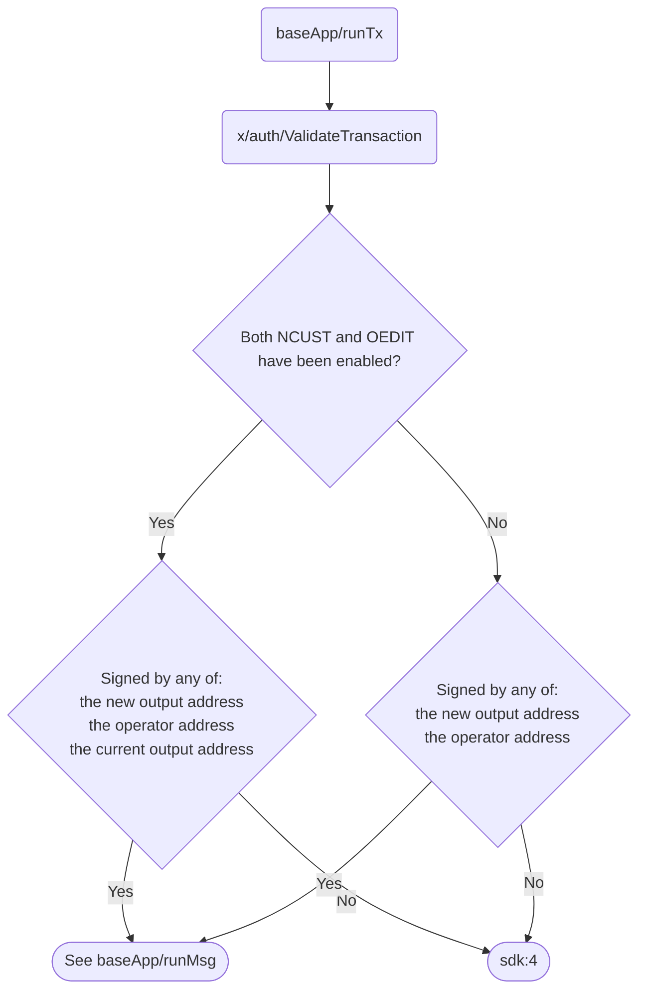
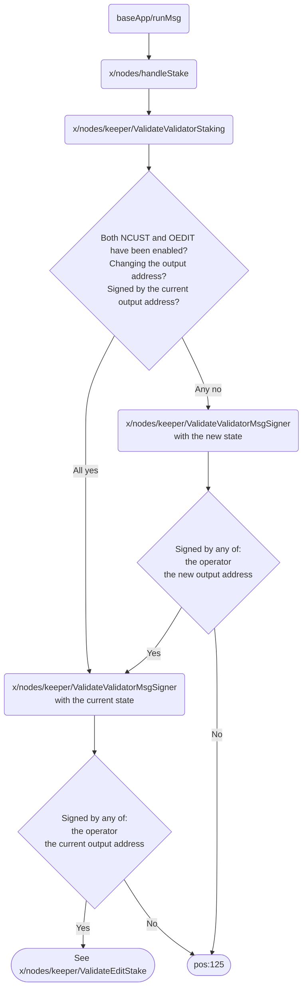
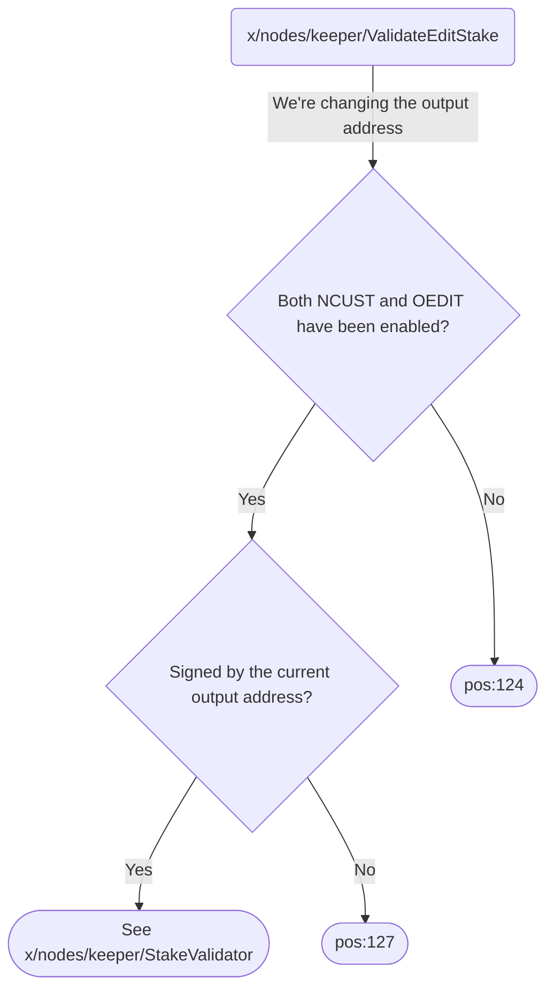
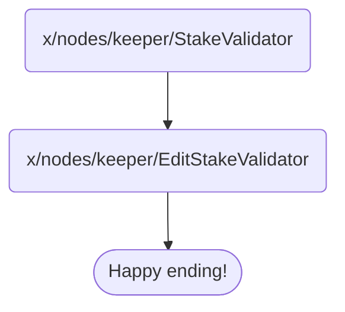

# Journey to changing a node's output address

A staked node's output address can be changed only when a transaction message
`MsgStake` is signed by the owner of the node's current output address.  The
following charts illustrate how a `MsgStake` is handled by the key functions
and the transaction is accepted or rejected by the blockchain.

## `baseApp/runTx`

The first validation occurs in `x/auth/ValidateTransaction`, where we make sure
an incoming `MsgStake` is signed by any of:

- The new output address specified in the transaction itself
- Node's operator address
- Node's current output address

## `baseApp/runMsg`

After `x/auth/ValidateTransaction`, the transaction is validated in
`x/nodes/keeper/ValidateValidatorStaking`, which validates all stake
transactions.  If the target operator is already staked, this function basically
calls `x/nodes/keeper/ValidateValidatorMsgSigner` twice, one for the new
parameters of the node, and one for the current parameters of the node.  If
the transaction is to edit the output address, we skip the first call.
If any calls to `x/nodes/keeper/ValidateValidatorMsgSigner` fails, the
transaction is rejected with the error code `pos:125`.

## `x/nodes/keeper/ValidateEditStake`

After `x/nodes/keeper/ValidateValidatorMsgSigner`,
`x/nodes/keeper/ValidateValidatorStaking` calls the final validation function
`x/nodes/keeper/ValidateEditStake`, which validates all editstake transactions.
The chart below focuses on the case of changing the output address.

## `x/nodes/keeper/StakeValidator`

After all validations above pass, we just go to
`x/nodes/keeper/EditStakeValidator` where we change the world state.

