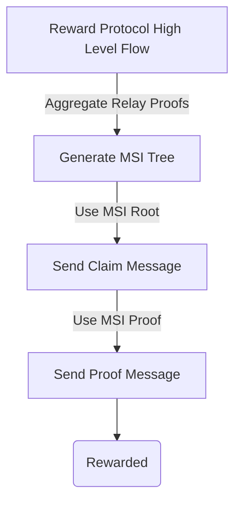
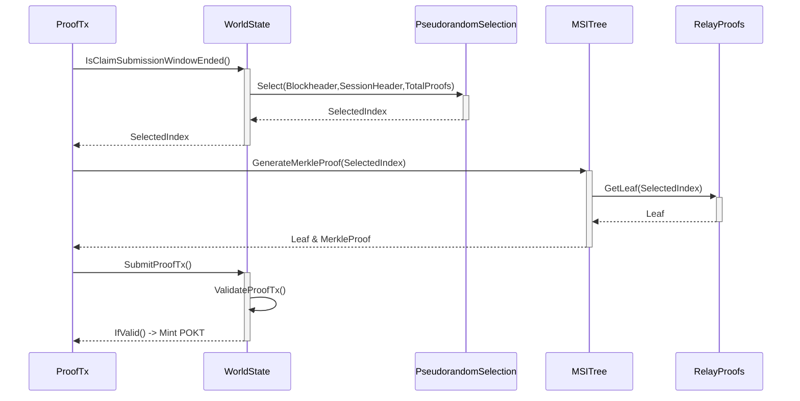

# Claims, Proofs, and Merkle Sum Index Trees

## Abstract

V0 of Pocket Network utilizes a custom reward protocol that enables a succinct and probabilistic proof of work completed. Specifically, this procedure allows staked Service Nodes to be retroactively rewarded POKT in exchange for a proof of Relays executed during a Session.

## High Level Process

The reward protocol is executed in a **3 step** process:

*Node creates a Merkle Tree locally*

**1) Generate Merkle Sum Index Tree using Relay Proofs**

*Then an ask-response cycle with the protocol state:*

**2) Claim Transaction (Node claims volume of Relays completed)**
**3) Prove Transaction (Node proves Claim using MSI Tree)**



## Generate Merkle Sum Index Tree
At a high level, the generation of the MSI tree is simply aggregating the Relay Proofs from the applicable Session and using each Proof as a leaf to build the Merkle Tree.

By building a tree out of the Relay Proofs, the protocol is able to verify a single leaf of the tree with a succinct < O(log(n) > Merkle Proof.


However, it is important to note the nuances of the MSI tree and why this specific flavor of Merkle tree is chosen.

The MSI Tree is based on [Plasma Core's Merkle Sum Tree](https://plasma-core.readthedocs.io/en/latest/specs/sum-tree.html).

Specifically, the property that is most interesting for Plasma Core's MST is:

> ... it allows us to calculate a specific range which a branch describes, and be 100% confident that no other valid branches exist which overlap that range.

This non-overlap property of branches in MSTs is foundational to preventing Replay Attacks of completed Relay Proofs in Pocket Network.

*NOTE:  The only difference between a Merkle Sum Tree and a Merkle Sum Index Tree is that the index of the leaf is utilized in the `ParentHash` function to add an extra layer of security around the swapping unique relays within a Merkle Tree.*

A replay attack is simply duplicating completed Relay Proofs inside a Merkle Tree to falsify additional Relays completed.


By ordering leafs by hashes and using the `Hash(left sibling)+1` as the `lower range` and the hash of the leaf as the `upper range`, Pocket Network is able to build a non-overlapping leaf - Merkle Tree.

It is very important for the reader to note two related parts to Pocket Networks Servicing Protocol:
- *Each Relay Proof is signed by the Application Client using the `SignBytes()` which is used to generate the `Hash(leafSignBytes)`.*
- *Service Nodes reject all `identical Relays` with a `Code: 37` Duplicate Proof Error*

Due to the signature scheme of Relay Servicing, a Service Node is unable to both falsify a Relay Proof in a Merkle Tree and have that Leaf be verifiable via the signature - completing the Replay Attack protection.

The Merkle Sum Index Tree enables:
- Enforceably Unique Relay Proof Leafs
- Succinct Proof of single Relay Proof Leaf
- Verifiable integrity of the indices of the Leafs using a Merkle Root

## Claim Transaction

After an active Session finishes and before the closing of the `Claim Submission Window`, a **Claim Transaction** is sent by Service Nodes to **claim** work completed.

```go
type MsgClaim interface {  
  SessionHeader()     // connect the work with a previous session
  MerkleRoot()        // lock in the integrity of the Leafs indices
  TotalProofs()       // lock in the range ( 0-TotalProofs ) 
  FromAddress()       // sender
  EvidenceType()      // relay (or challenge)
  ExpirationHeight()  // set at the protocol level based on gov params
}
```


The Claim Transaction enables the protocol to:
- Lock in the Merkle Root from the MSI Tree
- Establish a **range** or max index to select from

## Proof Transaction

The Claim Transaction sets up the protocol to be able to challenge the Node for a succinct proof of the work completed.

The network state now contains the Claim's Merkle Root and the maximum index it may select from.

Since the Merkle Root preserves the integrity of the Relay Proof indices and the MSI Tree ensures unique Relay Proofs as leafs, the protocol is able to use a single randomly selected leaf from the tree and use that as proof of the entire set as long as there exists a MSI Branch from the selected leaf to the given Merkle Root.



### Pseudorandom Selection Of Proof Index
Similar to the Session Protocol, the Pseudorandom Selection algorithm uses the BlockHash of `SessionEndHeight`+`ClaimSubmissionWindow` block as seed data for the Pseudorandom Selection.

```go
headerHash := sessionHeader.HashString()  
pseudoGenerator := pseudorandomGenerator{blockHash, headerHash}
r, err := json.Marshal(pseudoGenerator)  
...
PseudorandomSelection(totalRelays, Hash(r))
```

To increase security and to tailor unique index selections for each Node, the seed data is also calculated from the SessionHeader.

```go
func PseudorandomSelection(max sdk.BigInt, hash []byte) (index sdk.BigInt) {  
   // first 8 bytes of the seedHash
  intHash := sdk.NewIntFromBigInt(new(big.Int).SetBytes(hash[:8]))  
   // modulo the selection against the maximum of the range
  return intHash.Mod(max)  
}
```

*NOTE: The algorithm must be **pseudo**random because it must also be deterministic for the network to have Consensus on the agreed upon index.*

### Proof of the Claim

Once the Pseudorandom index is revealed to the network, the final step is for the Service Node to submit a `Proof Transaction` to the network to satisfy:
> the protocol is able to use a single randomly selected leaf from the tree and use that as proof of the entire set **as long as there exists a MSI Branch from the selected leaf to the given Merkle Root**

Using the previously generated MSI Tree, the Service Node is able to generate a MSI Branch from the Pseudorandomly Selected Leaf to the Merkle Root.

Including the Leaf and the MSI Branch, the Service Node is able to complete the lifecycle by submitting a **Proof Transaction** to the network.

```go
type MsgProof interface {  
   MerkleBranch()  // the MSI Branch
   Leaf()          // the pseudrandomly selected leaf
   EvidenceType()  // relay (or challenge)
}
```


### Reward

Like any Transaction, the proof is validated by all who process blocks.

In order to determine if a ProofTx is valid, several Validations must occur.

```go
func ValidateProofTx(proof MsgProof) error {  
  // find corresponding claim
  ...
  // validate session exists
  ...
  // generate pseudorandom index and validate against leaf
  ...
  // validate the merkle proof  
  ...
  // validate the leaf
}
```
If a Proof Transaction is `Code:0` (valid) then POKT reward is minted to the Service Node based on the current Governance Parameters.
