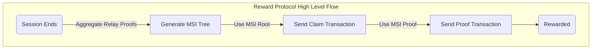
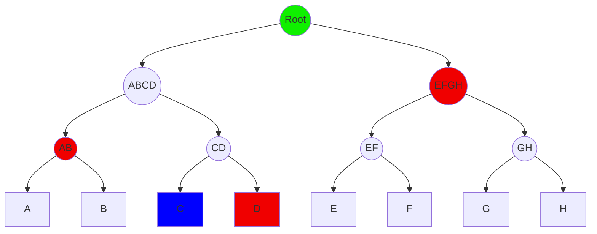
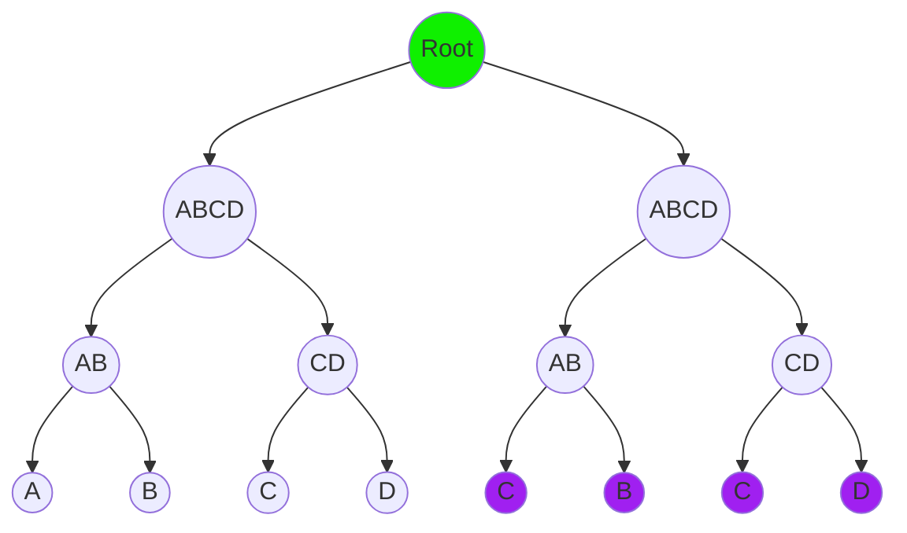
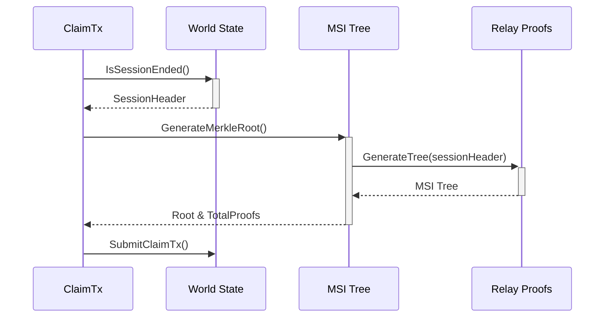
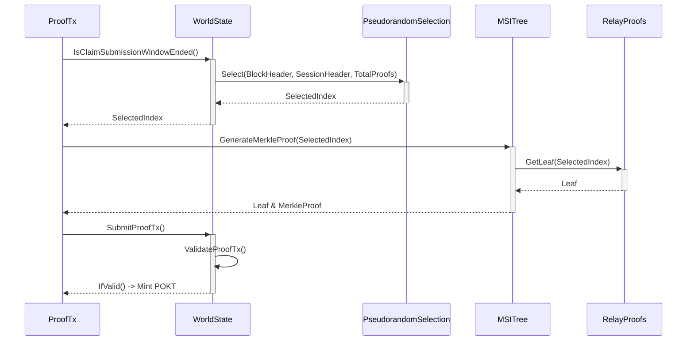

# Claims, Proofs, and Merkle Sum Index Trees <!-- omit in toc -->

## Table of Contents <!-- omit in toc -->

- [Abstract](#abstract)
- [High Level Process](#high-level-process)
- [Merkle Sum Index Tree Generation](#merkle-sum-index-tree-generation)
  - [Why an MSI Tree?](#why-an-msi-tree)
  - [The `Index` in a `Merkle Sum Index` Tree](#the-index-in-a-merkle-sum-index-tree)
  - [Relay Proof Falsification](#relay-proof-falsification)
- [Claim Transaction](#claim-transaction)
- [Proof Transaction](#proof-transaction)
  - [Pseudorandom Selection of Proof Index](#pseudorandom-selection-of-proof-index)
  - [Proof of the Claim](#proof-of-the-claim)
  - [Reward](#reward)
- [Additional References \& Resources](#additional-references--resources)

## Abstract

V0 of [Pocket Network](http://pokt.network) utilizes a custom reward protocol that enables a succinct non-interactive probabilistic proof of work (i.e. # of relays) completed. Specifically, this procedure allows staked Service Nodes to be retroactively rewarded POKT in exchange for a proof of Relays executed during a Session via a "commit-reveal" scheme.

The document below assumes an understanding of various Pocket Network related concepts, including but not limited to Relays, Sessions, Servicers, etc. Please visit [docs.pokt.network](https://docs.pokt.network) prior to reading this document if you are not familiar with this terminology.

<!-- TODO: Investigate whether this classifies as a SNARK per its formal definition. -->

## High Level Process

The reward protocol is executed in a **3 step** process:

1. Servicer generates a **Merkle Sum Index** (MSI) Tree using Relay Proofs

   \* _Node creates a Merkle Tree locally_ \*

2. Servicer submits a **Claim Transaction** (i.e. claim for volume of Relays complete)

   \* _A commit-reveal cycle begins by interacting with the state of the protocol_ \*

3. Servicer submits a **Proof Transaction** (i.e. proofs for a subset of Relays committed in the MSI Tree)



## Merkle Sum Index Tree Generation

At a high level, the generation of the MSI tree is the aggregation of Relay Proofs from the applicable Session, where each Relay Proof is used as a leaf to build the Merkle Tree.

By building a tree out of the Relay Proofs, the protocol is able to verify a single leaf of the tree with a succinct _O(log(n))_ Merkle Proof. Only the data in red in the diagram below must be supplied to verify the proof for a leaf; everything else may be computed by the verifier.



### Why an MSI Tree?

It is essential to understand the nuances of an MSI Tree and why this specific _flavour_ of Merkle Tree was chosen.

The MSI Tree is based on [Plasma Core's Merkle Sum Tree](https://plasma-core.readthedocs.io/en/latest/specs/sum-tree.html). It was primarily select due to having the [following property](https://plasma-core.readthedocs.io/en/latest/specs/sum-tree.html#calculating-a-branch-s-range):

> [...] it allows us to calculate a specific range which a branch describes, and be 100% confident that no other valid branches exist which overlap that range.

This non-overlap property of branches in MSTs is required to prevent Replay Attacks of completed Relay Proofs in Pocket Network. A replay attack is simply duplicating completed Relay Proofs inside a Merkle Tree to falsify additional Relays completed. For example, see how leafs `A`, `B`, `C`, `D` are duplicated at the bottom of the following tree:



Note that because [IAVL](https://github.com/cosmos/iavl) Merkle Tree implementation is used, the tree handles rotations and is always balanced (i.e. complete).

### The `Index` in a `Merkle Sum Index` Tree

_NOTE: The primary modification that was made to Plasma's Merkle Sum Tree in converting it to a Merkle Sum Index Tree is that the index of the leaf is utilized in the `ParentHash` function to add an extra layer of security around the swapping of unique relays within a Merkle Tree._

The Tree is built by:

1. Hashing each Relay Proof
2. Ordering hashes lexicographically
3. Creating a range using the left & right neighbors of each hash
   1. Lower range: `Hash(left neighbor)+1`
   2. Upper range: `Hash(current leaf)`

This enables Pocket Network to build non-overlapping leafs in a Merkle Sum Tree. For example, assume that these are ordered lexicographically: `[hash(A), hash(B), hash(C), hash(D)]`

- Range of leaf A: `[0 + 1, hash(A)]`
- Range of leaf B: `[hash(A) + 1, hash(B)]`
- Range of leaf C: `[hash(B) + 1, hash(C)]`
- Range of leaf D: `[hash(C) + 1, hash(D)]`

### Relay Proof Falsification

It is **very important** to note two related parts to Pocket Network's Servicing Protocol:

1. Each Relay Proof is signed by the Application Client using `SignBytes()` which is used to generate the `Hash(leafSignedBytes)`.
2. Service Nodes reject all `identical Relays` with a `Code: 37` (i.e. Duplicate Proof Error)

Due to the signature scheme of Relay Servicing, a Service Node is unable to both falsify a Relay Proof in a Merkle Tree and have that Leaf have a verifiable signature - thereby preventing a Replay Attack protection.

The Merkle Sum Index Tree enables:

- Enforceably Unique Relay Proof Leafs
- Succinct Proof of a single Relay Proof Leaf
- Verifiable integrity of the indices of the Leafs committed to a single Merkle Root

## Claim Transaction

After an active Session finishes and before the closing of the [Claim Submission Window](https://docs.pokt.network/learn/protocol-parameters/#claimsubmissionwindow), a **Claim Transaction** is sent by the Service Nodes to be stored on-chain to **claim** work completed. This claim contains a commitment to the root of the MSI Tree described above.

```go
type MsgClaim interface {
  SessionHeader()     // Link / chain the work to a specific prior session
  MerkleRoot()        // Commit to the integrity of the Leafs indices
  TotalProofs()       // Commit to the amount of work done (i.e. # of relays)
  FromAddress()       // Sender of the claim transaction (i.e. the Service Node)
  EvidenceType()      // Relay (or challenge which is outside the scope of this document)
  ExpirationHeight()  // The expiration height of the claim, prior to which the proof must be submitted (dictated by on-chain gov params)
}
```



The Claim Transaction enables the protocol to:

- Lock in the Merkle Root from the MSI Tree. This acts as a single commitment for all of the relays the Service Node has performed in a single session.
- Establish a **range** of indices to select a proof from. This ranges from 0 to the number of relays performed by the Service Node during a session.

## Proof Transaction

After submitting the Claim Transaction, the network/world state now contains the Claim's Merkle Root and the maximum index (i.e. max relay number) the Service Node may need need to submit a proof for. This sets up the protocol to be able to challenge the Service Node for a succinct proof of the work completed.

Since the Merkle Root preserves the integrity of all Relay Proofs & their indices and the MSI Tree ensures unique Relay Proofs as leafs, the protocol is able to use a single randomly selected leaf from the Tree and use that as proof of the entire set as long as there exists an MSI Branch from the selected leaf to the given Merkle Root. The assumption is made under the Random Oracle Model where the MSI Branch that's selected cannot be predicted ahead of time but is deterministic based on a future (relative to the time of claim) source of entropy.



### Pseudorandom Selection of Proof Index

Similar to the Session Protocol, the Pseudorandom Selection algorithm uses the BlockHash of `SessionEndHeight`+`ClaimSubmissionWindow` block as seed data for the Pseudorandom Selection.

```golang
headerHash := sessionHeader.HashString()
pseudoGenerator := pseudorandomGenerator{blockHash, headerHash}
r, err := json.Marshal(pseudoGenerator)
// ...
PseudorandomSelection(totalRelays, Hash(r))
```

To increase security and to tailor unique index selections for each Node, the seed data is also calculated from the SessionHeader.

```golang
func PseudorandomSelection(max sdk.BigInt, hash []byte) (index sdk.BigInt) {
   // first 8 bytes of the seedHash
  intHash := sdk.NewIntFromBigInt(new(big.Int).SetBytes(hash[:8]))
   // modulo the selection against the maximum of the range
  return intHash.Mod(max)
}
```

Note that this algorithm relies on Random Oracle assumptions such that the selection is **pseudo**random and must be deterministic in order to have Consensus on the agreed upon index.

### Proof of the Claim

Once the Pseudorandom index is revealed to the network, the final step is for the Service Node to submit a `Proof Transaction` to the network to satisfy the statement made above:

> the protocol is able to use a single randomly selected leaf from the tree and use that as proof of the entire set **as long as there exists a MSI Branch from the selected leaf to the given Merkle Root**

Using the previously generated MSI Tree, the Service Node is able to generate an MSI Proof from the pseudo-randomly selected leaf to the Merkle Root.

Including the Leaf and the MSI Branch, the Service Node is able to complete the lifecycle by submitting a **Proof Transaction** to the network.

```go
type MsgProof interface {
   MerkleBranch()  // The MSI Branch
   Leaf()          // The pseudrandomly selected leaf
   EvidenceType()  // Relay (or challenge which is outside the scope of this document))
}
```

### Reward

Like any Transaction, the proof is validated by all who process blocks.

In order to determine if a `ProofTx` is valid, several Validations must occur.

```go
func ValidateProofTx(proof MsgProof) error {
  // find the corresponding claim from world state
  ...
  // validate the session exists by comparing the session header against the world state
  ...
  // generate a pseudorandom index locally (using deterministic seeds) and validate against the leaf provided
  ...
  // validate the merkle proof (common cryptographic approach)
  ...
  // validate the leaf
}
```

If a Proof Transaction is `Code:0` (valid) then a POKT reward is minted to the Service Node based on a multiplier of the work (volume of relays done) and the current Governance Parameters.

## Additional References & Resources

**Documentation:**

- [Pocket Docs on Claim-Proof Lifecycle](https://docs.pokt.network/home/v0/protocol/servicing#claim-proof-lifecycle)
- [Twitter Thread by @o_rourke](https://twitter.com/o_rourke/status/1263847357122326530)
- [Plasma Core's Merkle Sum Tree](https://plasma-core.readthedocs.io/en/latest/specs/sum-tree.html)

**Source code references:**

- Merkle: [x/pocketcore/types/merkle.go](https://github.com/pokt-network/pocket-core/blob/staging/x/pocketcore/types/merkle.go)
- Claim: [x/pocketcore/keeper/claim.go](https://github.com/pokt-network/pocket-core/blob/staging/x/pocketcore/keeper/claim.go)
- Proof: [x/pocketcore/keeper/proof.go](https://github.com/pokt-network/pocket-core/blob/staging/x/pocketcore/keeper/proof.go)
