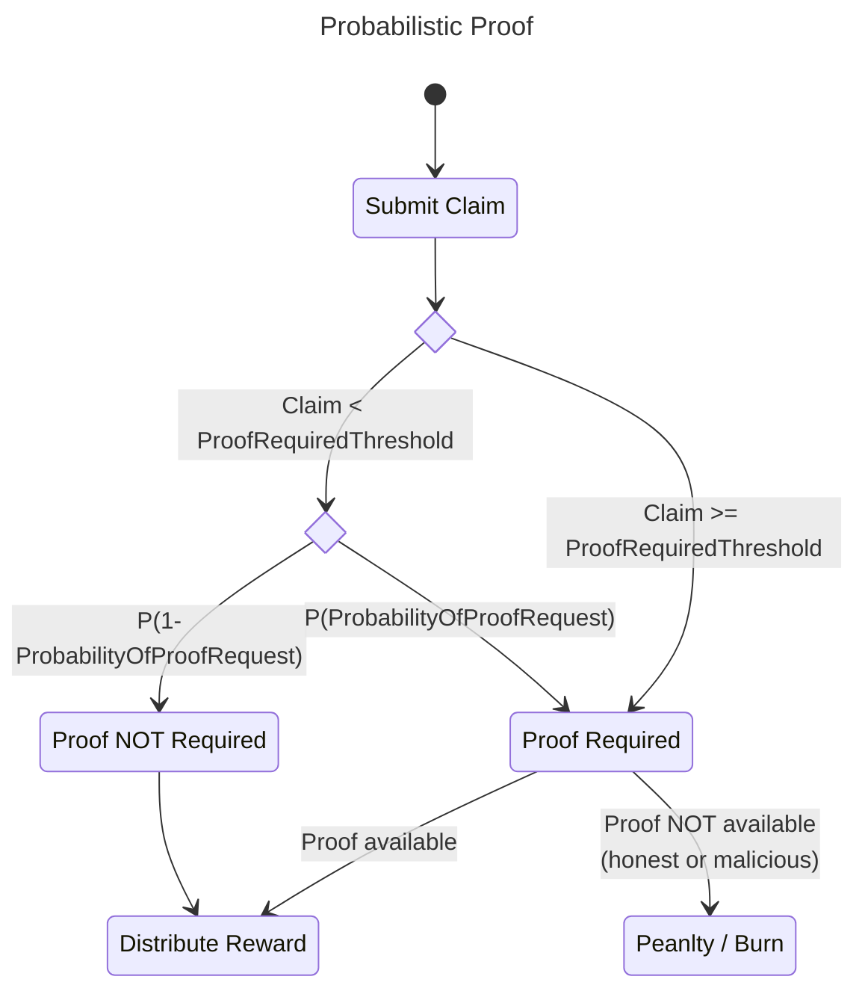

# Probabilistic Proofs <!-- omit in toc -->

- [Background \& Setup](#background--setup)
- [Flow](#flow)
- [Modelling the Attack](#modelling-the-attack)
  - [Definitions](#definitions)
  - [Questions](#questions)
  - [Example](#example)
    - [Setup](#setup)
    - [Model](#model)
      - [Burn Amount](#burn-amount)
  - [Solution](#solution)
- [\[WIP - do not read\]](#wip---do-not-read)
  - [Alt Solutions (Dissenting Opinions)](#alt-solutions-dissenting-opinions)
  - [Alt Attacks](#alt-attacks)

## Background & Setup

TODO: Copy over context from [notion](https://www.notion.so/Idea-Probabilistic-Proofs-f3fa87447f1c4c63b38b1ff46c049f67#d1f7699135fd438cb2251fa11a91f8cb)

## Flow



## Modelling the Attack

### Definitions

Define the sample space with a single definition success, and failure capturing everything else.

**Success**: Submit a false claim and get caught

**Failure**:

- (honest) Submit a true claim and prove it
- (honest) Submit a true claim and have no requirement to prove it
- (steal): Submit a false claim and get away with it
- (unlucky-tbd): Submit a true claim, but fail to prove it when required (e.g. technical reasons)

**TBD (be honest but unlucky)**:

### Questions

- How many success until a single failure?
- How many failures until a single success?
- How many failures until N success?
- How many success until N failures?
- What is the stopping condition?
- What should the burn amount be for failing to submit a required claim?
- What should `ProofRequiredThreshold` be?
- What should `ProbabilityOfProofRequest` be?
- With what probability should a malicious servicer get away?

### Example

#### Setup

The proofs for determining the appropriate values of `ProbabilityOfProofRequest` and `ProofRequiredThreshold` will be done by demonstrating the most optimal malicious behaviour an attacker should follow by example.

Assume `ProofRequiredThreshold = 100 POKT`. If the `Claim` is greater than or equal to `100 POKT`, a proof is mandatory. Therefore, the attacker can freeload by submitting claims for `99.99 POKT` and hope they never get caught. If they do get caught, the penalty (i.e. burn) should exceed the reward.

Since the attacker will never pass the `ProofRequiredThreshold` threshold, they can only get caught with `ProbabilityOfProofRequest` likelihood.

#### Model

The value for `ProofRequiredThreshold` is ignored since it "short circuits" the model.

We can use a [Geometric_distribution](https://en.wikipedia.org/wiki/Geometric_distribution) and identify the probability of `N` failures until a single success.

$$ p = ProbabilityOfProofRequest $$
$$ q = 1 - p $$
$$ Pr(X=k) = (1-p)^{k-1}p $$
$$ k = \frac{log(1-Pr(X=k))}{log(1-p)} $$
$$ k = \frac{log(1-Pr(X=k))}{log(q)} $$

To answer this question, we need to:

- Pick `p` - variable for scaling the network: 0.25 => 4x scale
- Select `Pr(X=k)` - the likelihood of `k` failures
- Introduce `BurnForFailedClaimSubmission` - penalty

```
  p = 0.25 => 4x scale
  0.99 = (1-0.25)\*_(x-1) _ 0.25
  x ≈ 4.766 = round(5)
  Set burn to threshold \* x
```

##### Burn Amount

`BurnForFailedClaimSubmission` is the penalty after `pocketcore/ClaimExpiration` expires. The validators will need to query all claims
expiring at the current height and apply the appropriate penalties.

### Solution

`ProofRequiredThreshold` - Should be set to a value whereby that that is `2σ` greater than the mean claim. This will mean that the other `97.3%` of claims will be subject to `ProbabilityOfProofRequest`.

`ProbabilityOfProofRequest` -

ProofRequiredThreshold

## [WIP - do not read]

### Alt Solutions (Dissenting Opinions)

- Warnings: Allow a tolerance (e.g. 2 warnings) until a burn happens.
  - Too complex
- Unclaim: Servicers can submit an unclaim message.
  - Too much state

### Alt Attacks

- A: Malicious users submit claims to bloat state?
- S: Validators need to disallow including it in the block if proof is not required

- Specify: how many times can I succeed? (i.e. steal pokt)
- How many times can I fail? (i.e. get caught) -> only once

```

```
