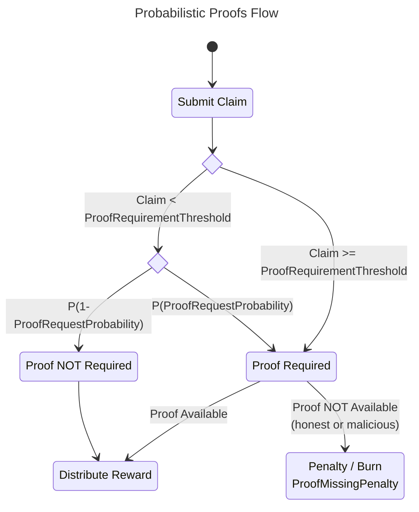

# Probabilistic Proofs <!-- omit in toc -->

<p align="center">
    @olshansk - Daniel Olshansky<br>
    @RawthiL - Ramiro R. C.<br>
    Feb 2023
</p>

This is a specification & proposal that will be submitted to [forum.pokt.network](https://forum.pokt.network) after peer-review.

**tl;dr Values Selected**

- `ProofRequirementThreshold` = `2σ` above network claim Claim `μ`
- `ProofRequestProbability` = `0.25`
- `Pr(X=k)` = `0.01`
- `k` (num failures) = `12`
- `ProofMissingPenalty` = `ProofRequirementThreshold * k`

- [Summary](#summary)
- [Specification](#specification)
  - [Governance Parameters](#governance-parameters)
  - [Parameter Usage](#parameter-usage)
  - [Flow](#flow)
  - [Scaling Benefits](#scaling-benefits)
- [Attack Modelling](#attack-modelling)
  - [Approach](#approach)
  - [Definitions](#definitions)
  - [Example](#example)
  - [Model](#model)
  - [Selecting Values](#selecting-values)
    - [Calculation](#calculation)
- [Dissenting Opinions](#dissenting-opinions)
  - [Malicious Attackers Bloating State](#malicious-attackers-bloating-state)
  - [Honest Servicers Getting Burnt](#honest-servicers-getting-burnt)

## Summary

The number of relays in Pocket Network (V0) is limited by the amount of block space utilized by Claim Proofs. The estimations done [here](https://docs.google.com/document/d/1QcsPfhj636zBazw2jAay8H6gdBKXcIMmohY0o321hhQ/edit) approximated it to be ~3B/day.

Several solutions were proposed [in this document](https://docs.google.com/document/d/1uBomaVieGAjsyHeqSlwmqOyPOln1CemVlWXZjQXUMRY/edit). This proposal outlines an alternate solution: **Probabilistic Proofs**.

In order for Servicers to be rewarded for their work, a fraction of the Claims submitted on-chain will require a Proof to also be submitted-on chain probabilistically under the random Oracle model.

This document assumes the reader has an understanding of the [reward protocol](https://github.com/pokt-network/pocket-core/blob/staging/doc/specs/reward_protocol.md).

## Specification

### Governance Parameters

Three new governance parameters will need to be added:

- `ProofRequestProbability`: Probability that a Claim will require a Proof to be rewarded; x ∈ ℝ ∣ 0 < x ≤ 1
- `ProofRequirementThreshold`: Claim amount (in uPOKT) above which a Proof will always be required; x ∈ ℝ ∣ x > 0
- `ProofMissingPenalty`: Burn (in uPOKT) that the Servicer faces if it does not provide a proof within `pocketcore/ClaimExpiration` for a Claim it previously submitted; x ∈ ℝ ∣ x > 0

### Parameter Usage

$$
Probably(ProofRequired) =
  \begin{cases}
    ProbabilityOfProofRequest &\text{if } Claim < ProofRequiredThreshold  \\
    1 &\text{if } Claim >= ProofRequiredThreshold.
  \end{cases}
$$

### Flow

The high-level flow is captured in the following diagram:



### Scaling Benefits

Assuming the majority of the block space is taken up by Proofs, The number of relays in the network scales inversely to `ProofRequestProbability`. Example:

- `ProofRequestProbability` = 0.5 -> 2x scale (~6B relays)
- `ProofRequestProbability` = 0.25 -> 4x scale (~12B relays)
- `ProofRequestProbability` = 0.1 -> 10x scale (~30B relays)

**Side benefit**: It has been shown that the majority of block verification time is spent validating the Proofs, so there would also be an upside on resource consumption.

_TODO(olshansky): Collect & provide data showing that the majority of the block space is taken up by proofs._
_TODO(olshansky): Collect & provide data showing that the majority of block verification._

## Attack Modelling

In order to select the values for the three parameters, the attacker's likelihood of adversarial reward & penalty must be modeled.

### Approach

An _attack by example_ approach is used determining the appropriate values for `ProofRequestProbability`, `ProofRequirementThreshold` and `ProofMissingPenalty`. This will demonstrate the optimal malicious behaviour an attacker should follow and tend to that case.

### Definitions

A Bernoulli probability distribution will be used whereby each `Claim` & `Proof` pair can be treated as an independent Bernoulli Trial. When the `Claim` exceeds `ProofRequirementThreshold`, the model is _"short-circuited"_ and is therefore outside the sample space for this definition.

The definition for success is taken from the Network's point of view.

- **Success**: Servicer submits a false claim and gets caught
- **Failure** (the remainder of the sample space excluding Success):
  - Servicer submits a true claim and is required prove it
  - Servicer a true claim and have no requirement to prove it
  - Servicer submits a false claim and gets away with it
  - Servicer submits a true claim, but fails to prove it

<!--
The types of questions we can ask are:

- What is the stopping condition?
- How many success until a single failure?
- How many failures until a single success?
- How many failures until N success?
- How many success until N failures?
- How much scalability does the network need?
- With what likelihood should an attacker get away?
-->

### Example

Assume:

- `ProofRequirementThreshold = 100 POKT`
- `ProofRequestProbability = 0.25`

If the `Claim` is greater than or equal to `100 POKT`, a proof is mandatory and the model is _"short-circuited"_. Therefore, the attacker can _freeload_ by submitting claims for `99.99 POKT` and hope they never get caught. If they do get caught (i.e. `Success`), the burn (i.e. `ProofMissingPenalty`) should exceed the total reward accumulated.

Since each claim is independent, an attacker would never submit a `Claim` exceeding `ProofRequirementThreshold`, and therefore have a `ProofRequestProbability` likelihood of being required to submit a proof.

### Model

A [Geometric_distribution](https://en.wikipedia.org/wiki/Geometric_distribution) is used to identify the probability of `k` failures (sample space containing an attacker getting away) until a single success (an attacker is caught).

### Geometric PDF

$$ p = ProofRequestProbability $$

$$ Pr(X<=k) = 1 - (1 - p)^k $$


### Geometric CDF

$$ p = ProofRequestProbability $$
$$ q = 1 - p $$

$$ Pr(X=k) = (1-p)^{k-1}p $$

$$ k = \frac{ln(\frac{Pr(X=k)}{p})}{ln(1-p)} + 1 $$


### Selecting Values

#### Calculation

_TODO(olshansky): Look at claims data to figure out the value for ProofRequirementThreshold_

`ProofRequirementThreshold` should be as small as possible so that most such that most Claims for into the probabilistic bucket, while also balancing out penalties that may be too large for faulty honest Servicers. It will be selected to be `2σ` above the Claim `μ` such that `97.3%` fall into the `ProofRequestProbability` part of the piecewise function.

`ProofRequestProbability (p)` is selected as `0.25` to enable scaling the network by `4x`.

`Pr(X=k) > 0` must be greater than 0 while minimizing `k` as much as possible, so it is selected at approximately `0.01.`.

$$ k = \frac{ln(\frac{Pr(X=k)}{p})}{ln(1-p)} + 1 $$

$$ k = \frac{ln(\frac{0.01}{0.25})}{ln(1-0.25)} + 1 $$

$$ k ≈ 12.19 $$

Selecting `k = 12` implies that there is an `~1%` of 12 failures (includes the sample space where an attacker gets away) until a single success (an attacker is caught). To deter this behaviour, the `ProofMissingPenalty` should be selected as 12 times `ProofRequirementThreshold`.

To answer this question, we need to:

- Pick `p` - variable for scaling the network (e.g. 0.25 => 4x network scale)
- Select `Pr(X=k)` - the likelihood of `k` failures
- Introduce `BurnForFailedClaimSubmission` - penalty for getting caught in falsifying a claim (or failing to submit a real claim)

`ProofRequirementThreshold` - Should be set to a value whereby that that is `2σ` greater than the mean claim. This will mean that the other `97.3%` of claims will be subject to `ProofRequestProbability`.

`ProofRequestProbability (p)` - Should be set to 1/n where n is the scaling factor needed for the network.

`k` - The number of claims submitted (failures) until a single success (a false claim is caught)

`BurnForFailedClaimSubmission` - Should be set to `k * ProofRequirementThreshold`

## Dissenting Opinions

### Malicious Attackers Bloating State

**Q**: Adversarial actors may continue submitting Proofs in excess of what's required to bloat the state of the chain.

**A**: In the Random Oracle model, only pseudo-randomly selected Claims seeded by on-chain data (e.g. LastBlockHash, hash(claim), ServicerPubKey, etc...) will be included by block proposers.

### Honest Servicers Getting Burnt

**Q**: An honest Servicer that submitted a Claim, but failed to submit a Proof within `pocketcore/ClaimExpiration` will be burnt. In today's model, they will only lose the rewards for the unproven Claim.

**A**: The onus is on the Servicer to upkeep their infrastructure. This is a tradeoff that must be considered as a risk/reward in exchange for the network's growth.

<!-- Supporting Python Code

## Appendix

### Python Code - Geometric PDF

```python
import numpy as np
import matplotlib.pyplot as plt
from matplotlib import cm

# Define the function
def f(x, p):
    return np.log(x/p) / np.log(1-p)

# Define the range of x values to plot
x = np.linspace(0.01, 1, 200)
xp = np.linspace(0.01, 1, 10)

# Plot the function for p = 0.2, p = 0.5, and p = 0.8
ps = [0.25, 0.5, 0.75, 0.9]
colors = cm.get_cmap('hsv', len(ps)+1)
for i, p in enumerate(ps):
    color = colors(i)
    y = f(x, p)
    yp = f(xp, p)
    plt.plot(x, y, label=f'p = {p}', color=color)
    # Select only the points where y > 0 and plot them as dots
    x_pos = xp[np.where(yp > 0)]
    y_pos = yp[np.where(yp > 0)]
    plt.plot(x_pos, y_pos, 'o', color=color)


# Add a horizontal line at y = 0
plt.axhline(y=0, color='gray', linestyle='--')

# Add legend, axis labels, and title
plt.legend()
plt.xlabel('Probability(X=k)')
plt.ylabel('k (num failures)')
plt.title('Number of failures until a single success')

# Display the plot
plt.show()
```

### Python Code - Geometric CDF

-->
