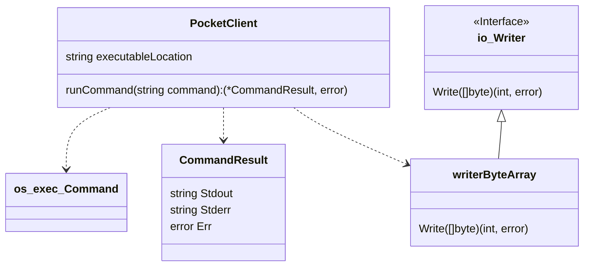
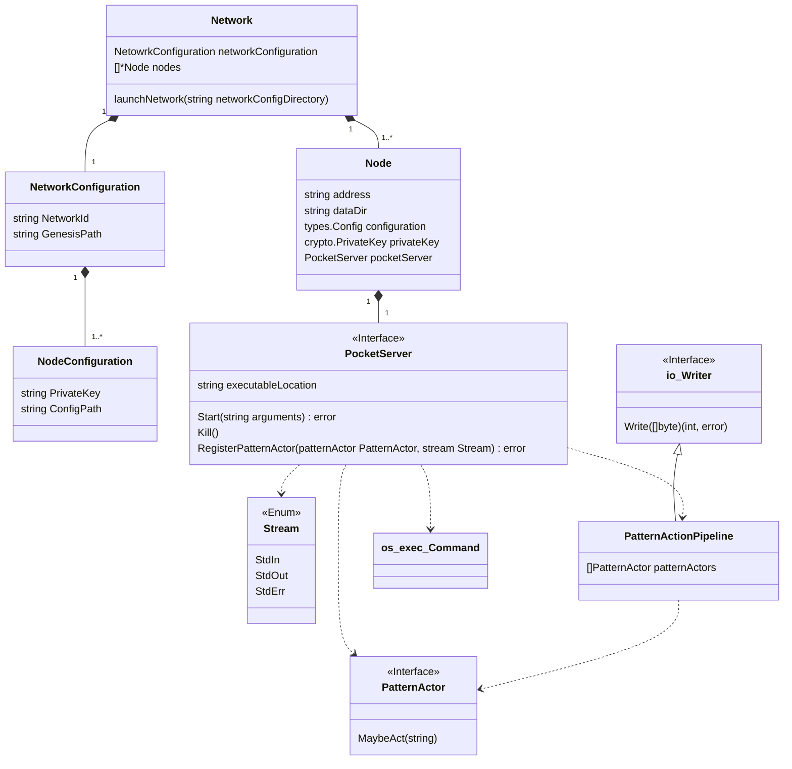

# End-to-end Pocket Core Testing Operation

In order to run the e2e test suite for pocket-core, we need to have:

- The `godog` executable available in our computer
- A pocket-core executable
- the `POCKET_EXE` environment variable with the path to the pocket-core
  executable we want to test

## Running the e2e test suite

The e2e test suite lives in the e2e/tests directory.

In order to run the full suite, we run `godog run *.feature`.

If we want to run a specific part of the suite, we can specify the file name,
and the command looks something like this: `godog run root.feature`.

If we want to test only one scenario
from the file, we can do it by specifying the line number of the Scenario,
running something like `godog run root.feature:3`.

## Adding tests to the e2e test suite

To add tests to the suite, we should look at the facilities we have
available; those are documented in the `steps_library_test.go` file, where
all the steps available are registered in the `InitializeScenario` function.

If we need examples for different ways to create scenarios using the steps,
we can look at the `.feature` files.

We are grouping tests by pocket the command used to invoke the functionality.
Thus, `query.feature` contains the scenarios that test the behavior we'd see
by using `pocket query`, and `stake.query` contains the scenarios that test
the behavior we'd see by using `pocket stake`, etc.

An addition to the test suite will usually mean adding or modifying
Scenarios in the existing `.feature` files.

### Facilities

Sometimes you need to add tests that need to do things that can't be done
given the steps or events available. In that case, a ticket should be opened in
the pocket-core repository asking for the facility you need, as those can
only be added with go code.

It is important to describe what you are trying to test, so that a
generalized step can be defined to achieve what you need and cooperate with
the other existing steps.

# End-to-end Pocket Core Testing Tooling Architecture and Rationale

The tooling to allow automated end-to-end testing of Pocket Core has an
architecture that can be extrapolated to allow for harnessing tests for
other software. It depends on availability of gherkin based test facilities,
which in the case of go means using `godog`.

There are two types of scenarios to cover. The simpler one is when the
executable runs and finishes -- ie: when it's "once and done";
the`stdout` and `stderr` outputs can be examined for the desired results.

The more complex one is when the executable is ongoing, such as when
running a pocket network node for a network bound scenario. In that case the
`stdout` and `stderr` need to be available for inspection and reaction during runtime.

## Standalone Scenarios

These scenarios use a small set of classes:



PocketClient coordinates all the work for these scenarios. It needs to
receive the location of the executable to run. It depends on
`os/exec/Command` to run it, and on the `writerByteArray`
implementation of `io/Writer` to capture the results of the
`os/exec/Command`'s output.

Segregating the contents of the output when adding them to `CommandResult`
by stream allows tests to verify that a certain output is sent where
expected, which is important in particular because both streams might be
redirected to different places.

The `Err` in `CommandResult` carries the error given by the
`os/exec/Command`, so it can be used to know whether the process ended
normally or if it could be started at all. This helps automate smokescreens,
like flag combinations that should not proceed.

### Note:

All input to the commands is assumed to be given at startup via flags
because Pocket Core's interactive reading of passwords
doesn't work with a pipe to `stdin`, because Pocket Core uses a facility that
allows hiding the password text in a terminal. This facility requires an
interactive shell in order to be used because of the mechanism used to hide
text. When it is not detected, the pipe is discarded along with the input and
the program acts as if it received an `EOF` (^D).

## Network Bound Scenarios

These scenarios are more convoluted to support and run because we run
_groups of processes_ and need to be able to react to the output of the
processes while they are still running.

The regular case will be that the network bound scenarios will use both these
classes and the classes needed for the Standalone scenarios.

Here's the class diagram:



The entry point for this diagram is the `Network`; in order to run scenarios
like these we need to have a `NetworkConfiguration`, which represents the
information needed to run an isolated pocket network cluster.

The information contained in `NetworkConfiguration` comprises:

- Node private keys and addresses
- App private keys and addresses
- genesis.json
- config.json for each node

When getting launched, the `Network` ensures a temporary directory for all
nodes to work from, and sets the respective data directory for each node
accordingly.

The `Node` objects know their data directory, address, pocket configuration,
private key, and have access to the `PocketServer` instance, where the magic
happens.

The `PocketServer` has access to the `os/exec/Command`, where the `StdOut`
and `StdErr` streams are connected to the `PatternActionPipeline`
implementation of `Writer`.

The `PocketServer` can be configured with a series of `PatternActors`, which
are functions that receive a string and "maybe act" on them. This is what
allows event processing and information extracting from the logs of a running
server.

An implementation of PatternActor to detect the latest height reported by
one of the nodes might look like this:

```go
package main

import (
	"regexp"
	"strconv"
	"strings"
)

type ServerHeightReporter struct {
	latestHeight int64
}

func (shr *ServerHeightReporter) MaybeAct(line string) {
	if strings.Contains(line, "Executed block") {
		var re = regexp.MustCompile(`([^\d]+)`)
		i, err := strconv.ParseInt(re.ReplaceAllString(line, ""), 10, 64)
		if err == nil {
			shr.latestHeight = i
		}
	}
}
```
