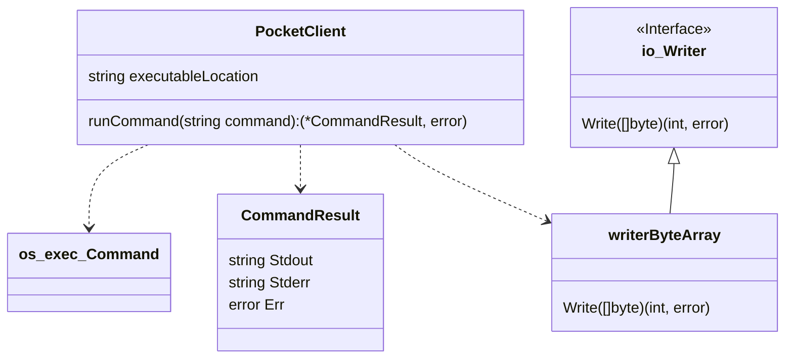

# Pocket Core End-To-End (e2e) Test Framework <!-- omit in toc -->

- [Background](#background)
  - [Terminology](#terminology)
- [Requirements \& Setup](#requirements--setup)
  - [Godog](#godog)
  - [Pocket Core Executable](#pocket-core-executable)
  - [POCKET\_EXE env](#pocket_exe-env)
- [Running the e2e test suite](#running-the-e2e-test-suite)
  - [tl;dr All at once](#tldr-all-at-once)
  - [Full Suite](#full-suite)
  - [Single Feature](#single-feature)
  - [Single Scenario](#single-scenario)
- [Adding New Tests](#adding-new-tests)
  - [New Steps](#new-steps)
  - [New Scenarios](#new-scenarios)
  - [New Features](#new-features)
- [Architecture](#architecture)
- [Standalone Scenarios](#standalone-scenarios)
  - [Standalone Architecture](#standalone-architecture)
- [Network Bound Scenarios](#network-bound-scenarios)
  - [Network Bound Architecture](#network-bound-architecture)
  - [Implementation Details](#implementation-details)
  - [Example](#example)

## Background

[Gherkin](https://cucumber.io/docs/gherkin/reference/) based test facilities, developed by [cucumber.io](https://cucumber.io), which use [godog](https://github.com/cucumber/godog).

### Terminology

- `Feature`: Tests are composed of `features` stored in `.feature` files
- `Scenario`: Feature files contain a list of `scenarios`, defined using Gherkin's syntax
- `Step`: Each `scenario` is composed of `steps` defined via go code in `steps_init_test.go`
- `PatternActor`: A pattern that can be triggered based on certain node actions

## Requirements & Setup

In order to run the e2e test suite for `pocket-core`, we need to have:

1. `godog` installed locally
2. A local `pocket-core` executable; the one to be tested
3. `POCKET_EXE` env variable set to the executable in step (2)

### Godog

Installing godog:

```bash
go install github.com/cucumber/godog/cmd/godog@latest
```

### Pocket Core Executable

```bash
go build -o pocket app/cmd/pocket_core/main.go # from the root directory
```

### POCKET_EXE env

```bash
export POCKET_EXE=`pwd`/pocket
```

## Running the e2e test suite

The e2e test suite lives under `/e2e/tests`.

The commands below assume you have executed `cd ./e2e/tests`.

### tl;dr All at once

```bash
cd e2e/tests
go build -o pocket ../../app/cmd/pocket_core/main.go
POCKET_EXE=./../../pocket godog run *.feature
```

### Full Suite

The full test suite can be run with:

```bash
godog run \*.feature
```

### Single Feature

A specific part of the suite can be run by specifying the filename:

```bash
godog run root.feature
```

### Single Scenario

A specific Scenario can be executed by specifying the line number:

```bash
godog run root.feature:3
```

## Adding New Tests

### New Steps

Supported `Step`s are defined in `InitializeScenario` in [`steps_library_test.go`](./tests/steps_library_test.go).

New `Step` definitions should be added there if needed.

### New Scenarios

The Steps available can be composed to create **Scenario**s, which can be found in any of the `.feature` files.

See [Gherkin's keywords](https://cucumber.io/docs/gherkin/reference/#keywords) for a list of all the Step qualifiers available: `Given`, `When`, `Then`, `And`, `But`.

### New Features

Tests are grouped based on the pocket CLI command invoked.

For example, `query.feature` contains the scenarios for the behaviour called via `pocket query`.

## Architecture

The test framework covers two execution types:

1. **Once and done (Standalone)**
2. **Ongoing (Network Bound)**

## Standalone Scenarios

The executable runs & finishes. The `stdout` and `stderr` outputs can be examined and validated against the desired result.

### Standalone Architecture

The following class diagram captures the implementation of the structures used in standalone (i.e. once-and-done) scenarios:



`PocketClient` coordinates all the work for these scenarios:

1. Requires location of the executable to run
2. Depends on `os/exec/Command` to run it
3. Captures results of (2) via `writerByteArray` implementation of `io/Writer`

`CommandResult` captures and enables processing of the output:

- Separates the output of the `stdout` and `stderr` streams
- Captures the error in `Err` to aid in automation

_NOTE: All input to the commands must be given to the executable via flags_

## Network Bound Scenarios

Executable is ongoing; such as a network bound scenario. The `stdout` and `stderr` streams need to be continuously available for inspection & reaction during runtime.

### Network Bound Architecture

The following class diagram captures the implementation of the structures used in network bound (i.e. ongoing) scenarios:


### Implementation Details

The complexity of these scenarios is larger due to the ongoing liveness of the processes and dependencies atop of the Standalone scenarios.

The `Network` structure is the entrypoint to a `NetworkConfiguration` (an isolated cluster) containing the following:

- Node - PrivateKeys and Addresses
- App - PrivateKeys and Addresses
- `genesis.json`
- Node - `config.json` for each

Each launched Node as a `PocketServer` instance:

- Has a temporary working directory (datadir, address, config, key, etc...)
- Output of `os/exec/Command` where `StdOut` and `StdErr` are streamed
- Configured via a series of `PatternActors`; callbacks triggered when new data comes in

### Example

An implementation of the `PatternActor` to detect the latest height reported by one of the nodes might look like this:

```go
package main

import (
    "regexp"
    "strconv"
    "strings"
)

type ServerHeightReporter struct {
    latestHeight int64
}

func (shr *ServerHeightReporter) MaybeAct(line string) {
    if strings.Contains(line, "Executed block") {
        var re = regexp.MustCompile(`([^\d]+)`)
        i, err := strconv.ParseInt(re.ReplaceAllString(line, ""), 10, 64)
        if err == nil {
            shr.latestHeight = i
        }
    }
}
```
