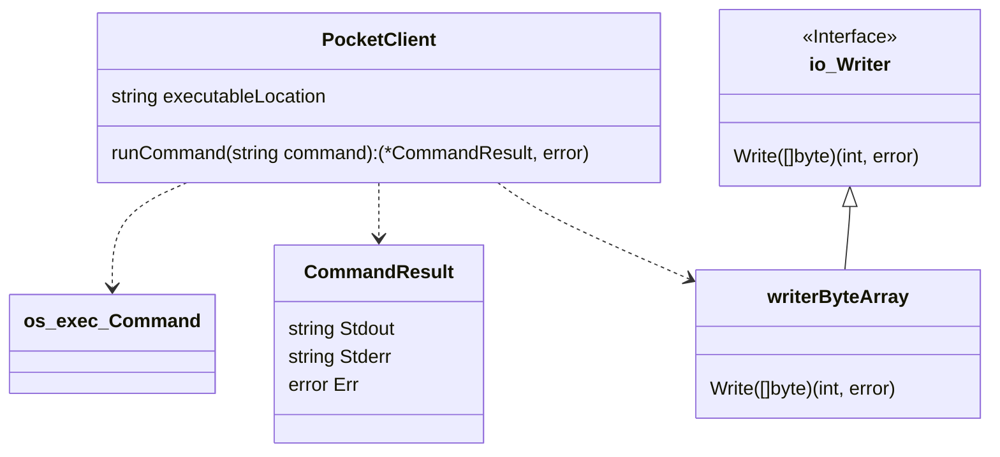
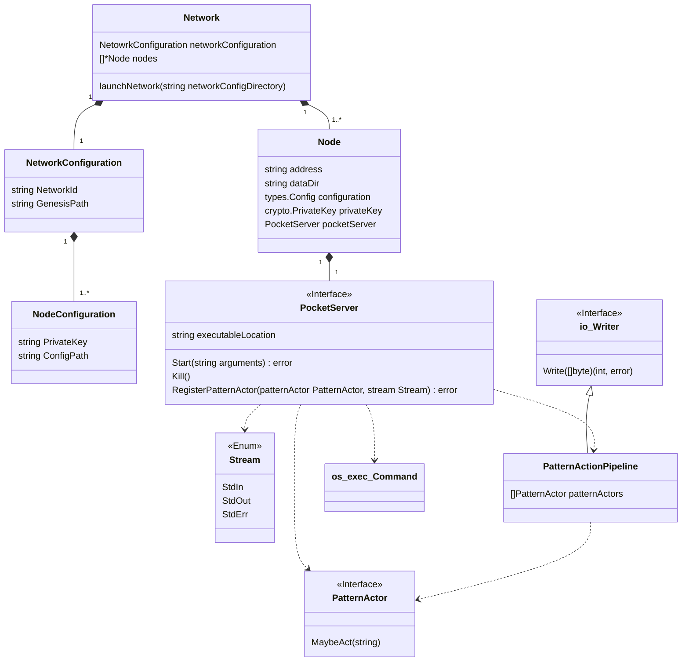

# End-to-end Pocket Core Testing Tooling

The tooling to allow automated end-to-end testing of Pocket Core has an
architecture that can be extrapolated to allow for harnessing tests for
other software.

There are two types of scenarios to cover. The simpler one is when the
executable runs and finishes -- ie: when it's "once and done";
the`stdout` and `stderr` outputs can be examined for the desired results.

The more complex one is when the executable is "ongoing", such as when
running a pocket network node. In that case the `stdout` and `stderr` need
to be available for inspection and reaction during runtime.

# Once And Done Scenarios

These scenarios use a small set of classes:



PocketClient coordinates all the work for these scenarios. It needs to
receive the location of the executable to run. It depends on
`os/exec/Command` to run it, and on the `writerByteArray`
implementation of `io/Writer` to capture the results of the
`os/exec/Command`'s output.

Segregating the contents of the output when adding them to `CommandResult`
by stream allows tests to verify that a certain output is sent where
expected, which is important in particular because both streams might be
redirected to different places.

The `Err` in `CommandResult` carries the error given by the
`os/exec/Command`, so it can be used to know whether the process ended
normally or if it could be started at all. This helps automate smokescreens,
like flag combinations that should not proceed.

## Note:

All input to the commands is assumed to be given at startup via flags
because Pocket Core's interactive reading of passwords
doesn't work with a pipe to `stdin`, because Pocket Core uses a facility that
allows hiding the password text in a terminal. This facility requires an
interactive shell in order to be used because of the mechanism used to hide
text. When it is not detected, the pipe is discarded along with the input and
the program acts as if it received an `EOF` (^D).

# Ongoing Scenarios

These scenarios are more convoluted to support and run because we run
_groups of processes_ and need to be able to react to the output of the
processes while they are still running.

The regular case will be that the ongoing scenarios will use both these
classes and the classes needed for the "Once and Done" scenarios.

Here's the class diagram:



The entry point for this diagram is the `Network`; in order to run scenarios
like these we need to have a `NetworkConfiguration`, which represents the
information needed to run an isolated pocket network cluster.

The information contained in `NetworkConfiguration` comprises:

- Node private keys and addresses
- App private keys and addresses
- genesis.json
- config.json for each node

When getting launched, the `Network` ensures a temporary directory for all
nodes to work from, and sets the respective data directory for each node
accordingly.

The `Node` objects know their data directory, address, pocket configuration,
private key, and have access to the `PocketServer` instance, where the magic
happens.

The `PocketServer` has access to the `os/exec/Command`, where the `StdOut`
and `StdErr` streams are connected to the `PatternActionPipeline`
implementation of `Writer`.

The `PocketServer` can be configured with a series of `PatternActors`, which
are functions that receive a string and "maybe act" on them. This is what
allows event processing and information extracting from the logs of a running
server.

An implementation of PatternActor to detect the latest height reported by
one of the nodes might look like this:

```go
package main

import (
	"regexp"
	"strconv"
	"strings"
)

type ServerHeightReporter struct {
	latestHeight int64
}

func (shr *ServerHeightReporter) MaybeAct(line string) {
	if strings.Contains(line, "Executed block") {
		var re = regexp.MustCompile(`([^\d]+)`)
		i, err := strconv.ParseInt(re.ReplaceAllString(line, ""), 10, 64)
		if err == nil {
			shr.latestHeight = i
		}
	}
}
```
